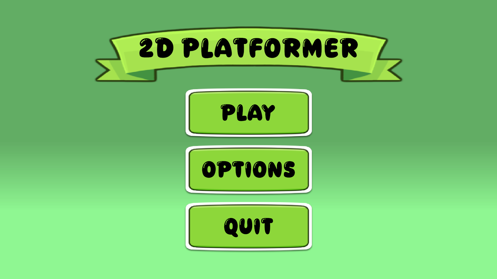
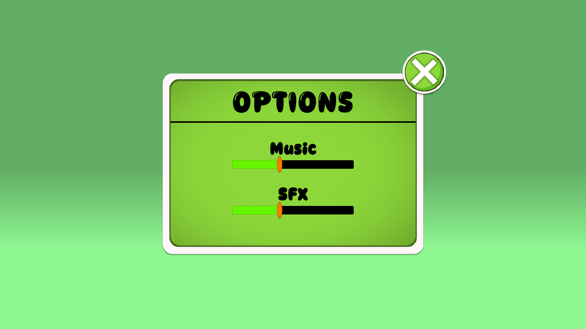
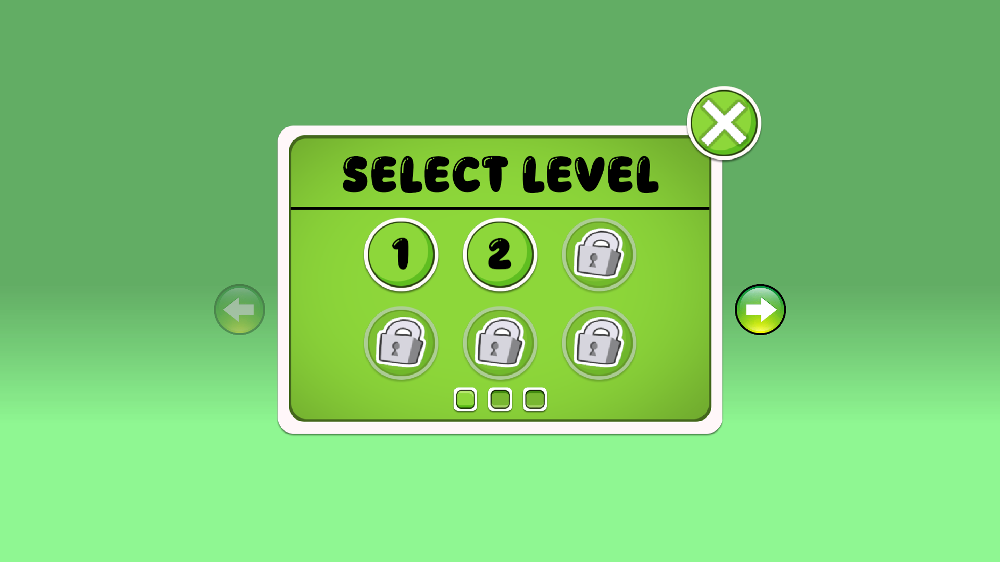
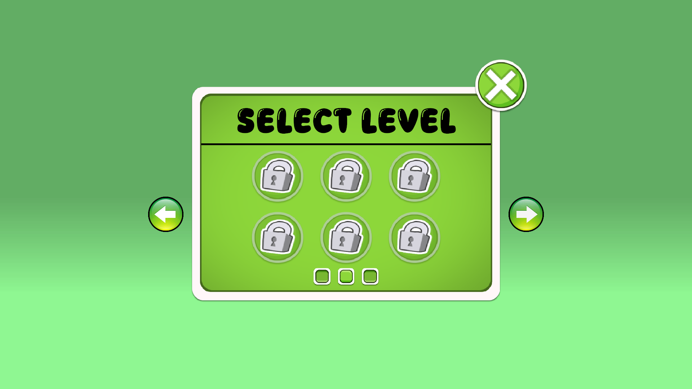
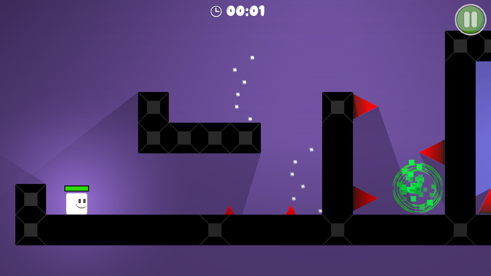

# 🎮 2D Platformer Game

This is a 2D platformer game project made with Unity, inspired by **Rehope Games' "Make a Game | 2D Platformer"** tutorial playlist on YouTube.

The game features elements similar to **Geometry Dash**, with creative twists such as trap obstacles, movement-based controls (instead of jumping), and a health management system.

---

## 📽️ Tutorial Reference

Inspired by:  
[🔗 Rehope Games - "Make a Game | 2D Platformer" Playlist](https://www.youtube.com/playlist?list=PLKmzL1GxQ4qKXYHw-udIXt6mOSlN8QyC8)

> We followed the free public tutorials and did not use any Patreon-exclusive content.  
> All assets and code in this repository were either created by us or are free to use under open licenses.  
> 🎨 Some sprites used in this project were provided by Rehope Games through a **Google Drive link** in their video description and are used with attribution.

---

## 🛠️ Built With

- **Engine:** Unity  
- **Language:** C#  
- **Platform:** 2D Game  
- **IDE:** Unity Editor 2022.3 

---

## 🎮 Game Features

- 🔁 Trap mechanics and buff effects
- 🕹️ Movement-based control (no jumping mechanic)
- ❤️ Health system that manages player state
- 🧠 Level design with hazard and power-up interactions
- 🎨 Simple UI for gameplay feedback (e.g., health bar, damage effects)

---

## 🧠 What I Learned

- Unity 2D physics and player controller logic  
- Custom movement systems and health handling  
- Animation triggering via scripts  
- Working with traps, buffs, and collision systems  
- Adapting tutorials while building unique mechanics

---

## 📸 Screenshots / Preview

